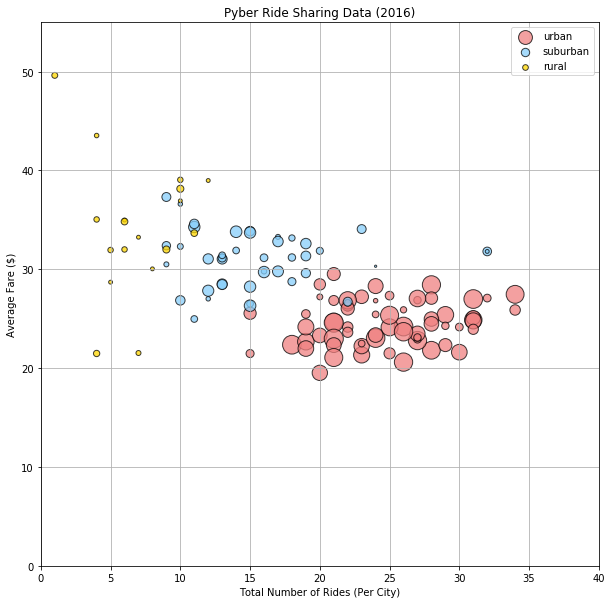
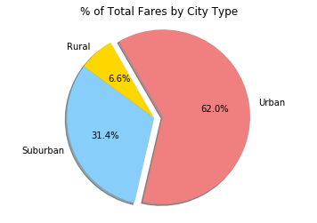
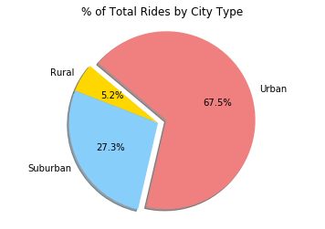
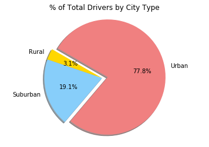

```python
#OBSERVATIONS

# 1) Most of the users of the ride application are in urban areas.
# 2) About 78% of the application drivers drive in urban areas.
# 3) About 62% of total revenue from ride fares comes from urban areas.
```


```python
import pandas as pd
import numpy as np
import matplotlib.pyplot as plt
import seaborn as sns


```


```python
city_data = "raw_data/city_data.csv"
ride_data = "raw_data/ride_data.csv"


ride_data_df = pd.read_csv(ride_data)
ride_data_df.head()
```


<div>
<style>
    .dataframe thead tr:only-child th {
        text-align: right;
    }

    .dataframe thead th {
        text-align: left;
    }

    .dataframe tbody tr th {
        vertical-align: top;
    }
</style>
<table border="1" class="dataframe">
  <thead>
    <tr style="text-align: right;">
      <th></th>
      <th>city</th>
      <th>date</th>
      <th>fare</th>
      <th>ride_id</th>
    </tr>
  </thead>
  <tbody>
    <tr>
      <th>0</th>
      <td>Sarabury</td>
      <td>2016-01-16 13:49:27</td>
      <td>38.35</td>
      <td>5403689035038</td>
    </tr>
    <tr>
      <th>1</th>
      <td>South Roy</td>
      <td>2016-01-02 18:42:34</td>
      <td>17.49</td>
      <td>4036272335942</td>
    </tr>
    <tr>
      <th>2</th>
      <td>Wiseborough</td>
      <td>2016-01-21 17:35:29</td>
      <td>44.18</td>
      <td>3645042422587</td>
    </tr>
    <tr>
      <th>3</th>
      <td>Spencertown</td>
      <td>2016-07-31 14:53:22</td>
      <td>6.87</td>
      <td>2242596575892</td>
    </tr>
    <tr>
      <th>4</th>
      <td>Nguyenbury</td>
      <td>2016-07-09 04:42:44</td>
      <td>6.28</td>
      <td>1543057793673</td>
    </tr>
  </tbody>
</table>
</div>


```python
city_data_df = pd.read_csv(city_data)
city_data_df.head()
```


<div>
<style>
    .dataframe thead tr:only-child th {
        text-align: right;
    }

    .dataframe thead th {
        text-align: left;
    }

    .dataframe tbody tr th {
        vertical-align: top;
    }
</style>
<table border="1" class="dataframe">
  <thead>
    <tr style="text-align: right;">
      <th></th>
      <th>city</th>
      <th>driver_count</th>
      <th>type</th>
    </tr>
  </thead>
  <tbody>
    <tr>
      <th>0</th>
      <td>Kelseyland</td>
      <td>63</td>
      <td>Urban</td>
    </tr>
    <tr>
      <th>1</th>
      <td>Nguyenbury</td>
      <td>8</td>
      <td>Urban</td>
    </tr>
    <tr>
      <th>2</th>
      <td>East Douglas</td>
      <td>12</td>
      <td>Urban</td>
    </tr>
    <tr>
      <th>3</th>
      <td>West Dawnfurt</td>
      <td>34</td>
      <td>Urban</td>
    </tr>
    <tr>
      <th>4</th>
      <td>Rodriguezburgh</td>
      <td>52</td>
      <td>Urban</td>
    </tr>
  </tbody>
</table>
</div>


```python
ride_groupby = ride_data_df.groupby('city')
ride_percity = ride_groupby.count()['fare']
avg_percity = ride_groupby.mean()['fare']
fare_percity = ride_groupby.sum()['fare']

```


```python
city_data_df.set_index('city', inplace=True)
city_data_df['avg fare'] = avg_percity
city_data_df['ride count'] = ride_percity
city_data_df['total fare'] = fare_percity
city_data_df.head()
```


<div>
<style>
    .dataframe thead tr:only-child th {
        text-align: right;
    }

    .dataframe thead th {
        text-align: left;
    }

    .dataframe tbody tr th {
        vertical-align: top;
    }
</style>
<table border="1" class="dataframe">
  <thead>
    <tr style="text-align: right;">
      <th></th>
      <th>driver_count</th>
      <th>type</th>
      <th>avg fare</th>
      <th>ride count</th>
      <th>total fare</th>
    </tr>
    <tr>
      <th>city</th>
      <th></th>
      <th></th>
      <th></th>
      <th></th>
      <th></th>
    </tr>
  </thead>
  <tbody>
    <tr>
      <th>Kelseyland</th>
      <td>63</td>
      <td>Urban</td>
      <td>21.806429</td>
      <td>28</td>
      <td>610.58</td>
    </tr>
    <tr>
      <th>Nguyenbury</th>
      <td>8</td>
      <td>Urban</td>
      <td>25.899615</td>
      <td>26</td>
      <td>673.39</td>
    </tr>
    <tr>
      <th>East Douglas</th>
      <td>12</td>
      <td>Urban</td>
      <td>26.169091</td>
      <td>22</td>
      <td>575.72</td>
    </tr>
    <tr>
      <th>West Dawnfurt</th>
      <td>34</td>
      <td>Urban</td>
      <td>22.330345</td>
      <td>29</td>
      <td>647.58</td>
    </tr>
    <tr>
      <th>Rodriguezburgh</th>
      <td>52</td>
      <td>Urban</td>
      <td>21.332609</td>
      <td>23</td>
      <td>490.65</td>
    </tr>
  </tbody>
</table>
</div>


```python
urban_df = city_data_df.loc[city_data_df['type']=='Urban',:]
suburb_df = city_data_df.loc[city_data_df['type']=='Suburban',:]
rural_df = city_data_df.loc[city_data_df['type']=='Rural',:]
rural_df.head()
```


<div>
<style>
    .dataframe thead tr:only-child th {
        text-align: right;
    }

    .dataframe thead th {
        text-align: left;
    }

    .dataframe tbody tr th {
        vertical-align: top;
    }
</style>
<table border="1" class="dataframe">
  <thead>
    <tr style="text-align: right;">
      <th></th>
      <th>driver_count</th>
      <th>type</th>
      <th>avg fare</th>
      <th>ride count</th>
      <th>total fare</th>
    </tr>
    <tr>
      <th>city</th>
      <th></th>
      <th></th>
      <th></th>
      <th></th>
      <th></th>
    </tr>
  </thead>
  <tbody>
    <tr>
      <th>South Elizabethmouth</th>
      <td>3</td>
      <td>Rural</td>
      <td>28.698000</td>
      <td>5</td>
      <td>143.49</td>
    </tr>
    <tr>
      <th>East Troybury</th>
      <td>3</td>
      <td>Rural</td>
      <td>33.244286</td>
      <td>7</td>
      <td>232.71</td>
    </tr>
    <tr>
      <th>Kinghaven</th>
      <td>3</td>
      <td>Rural</td>
      <td>34.980000</td>
      <td>6</td>
      <td>209.88</td>
    </tr>
    <tr>
      <th>New Johnbury</th>
      <td>6</td>
      <td>Rural</td>
      <td>35.042500</td>
      <td>4</td>
      <td>140.17</td>
    </tr>
    <tr>
      <th>Erikport</th>
      <td>3</td>
      <td>Rural</td>
      <td>30.043750</td>
      <td>8</td>
      <td>240.35</td>
    </tr>
  </tbody>
</table>
</div>


```python
# Bubble Plot

fig = plt.figure(figsize=(10,10))
ax1 = fig.add_subplot(1,1,1)

ax1.scatter(urban_df['ride count'], urban_df['avg fare'], s=5*urban_df['driver_count'], c='lightcoral', marker='o',edgecolors="black", label='urban', alpha=0.75)
ax1.scatter(suburb_df['ride count'], suburb_df['avg fare'], s=5*suburb_df['driver_count'], c='lightskyblue', marker="o",edgecolors="black", label='suburban', alpha=0.75)
ax1.scatter(rural_df['ride count'], rural_df['avg fare'], s=5*rural_df['driver_count'], c='Gold', marker="o",edgecolors="black", label='rural',alpha=0.75)

plt.xlabel("Total Number of Rides (Per City)")
plt.ylabel("Average Fare ($)")
plt.title('Pyber Ride Sharing Data (2016)')
plt.ylim(0, 55)
plt.xlim(0, 40)
plt.legend(loc='upper right')
plt.grid()

plt.savefig('pyber.png')
plt.show()


```





```python
# % of Total Fares by City Type
total_fares_by_citytype = city_data_df.groupby('type')['total fare'].sum()
total_fares_by_citytype_df = pd.DataFrame(total_fares_by_citytype)

fare_total = total_fares_by_citytype_df.sum()

percent_of_total_fares_by_type = total_fares_by_citytype_df/fare_total * 100
percent_of_total_fares_by_type.head()
```


<div>
<style>
    .dataframe thead tr:only-child th {
        text-align: right;
    }

    .dataframe thead th {
        text-align: left;
    }

    .dataframe tbody tr th {
        vertical-align: top;
    }
</style>
<table border="1" class="dataframe">
  <thead>
    <tr style="text-align: right;">
      <th></th>
      <th>total fare</th>
    </tr>
    <tr>
      <th>type</th>
      <th></th>
    </tr>
  </thead>
  <tbody>
    <tr>
      <th>Rural</th>
      <td>6.579786</td>
    </tr>
    <tr>
      <th>Suburban</th>
      <td>31.445750</td>
    </tr>
    <tr>
      <th>Urban</th>
      <td>61.974463</td>
    </tr>
  </tbody>
</table>
</div>


```python
# % of Total Fares by City Type - Pie Chart

labels = ["Rural", "Suburban", "Urban"]

# The values of each section of the pie chart
sizes = [6.579786, 31.445750, 61.974463]

# The colors of each section of the pie chart
colors = ["Gold", "lightskyblue", "lightcoral"]

# Tells matplotlib to seperate the "Python" section from the others
explode = (0, 0, 0.1)
plt.pie(sizes, explode=explode, labels=labels, colors=colors,
        autopct="%1.1f%%", shadow=True, startangle=120)

plt.axis("equal")
plt.title('% of Total Fares by City Type')

plt.show()
```





```python
# % of Total Rides by City Type
total_rides_by_citytype = city_data_df.groupby('type')['ride count'].sum()
total_rides_by_citytype_df = pd.DataFrame(total_rides_by_citytype)

ride_total = total_rides_by_citytype_df.sum()

percent_of_total_rides_by_type = total_rides_by_citytype_df/ride_total * 100
percent_of_total_rides_by_type.head()
```


<div>
<style>
    .dataframe thead tr:only-child th {
        text-align: right;
    }

    .dataframe thead th {
        text-align: left;
    }

    .dataframe tbody tr th {
        vertical-align: top;
    }
</style>
<table border="1" class="dataframe">
  <thead>
    <tr style="text-align: right;">
      <th></th>
      <th>ride count</th>
    </tr>
    <tr>
      <th>type</th>
      <th></th>
    </tr>
  </thead>
  <tbody>
    <tr>
      <th>Rural</th>
      <td>5.193187</td>
    </tr>
    <tr>
      <th>Suburban</th>
      <td>27.295388</td>
    </tr>
    <tr>
      <th>Urban</th>
      <td>67.511425</td>
    </tr>
  </tbody>
</table>
</div>


```python
# % of Total Rides by City Type - Pie Chart

labels = ["Rural", "Suburban", "Urban"]

# The values of each section of the pie chart
sizes = [5.193187, 27.295388, 67.511425]

# The colors of each section of the pie chart
colors = ["Gold", "lightskyblue", "lightcoral"]

# Tells matplotlib to seperate the "Python" section from the others
explode = (0, 0, 0.1)
plt.pie(sizes, explode=explode, labels=labels, colors=colors,
        autopct="%1.1f%%", shadow=True, startangle=140)

plt.axis("equal")
plt.title("% of Total Rides by City Type")

plt.show()
```





```python
# % of Total Drivers by City Type
total_drivers = city_data_df.groupby('type')['driver_count'].sum()
total_drivers_df = pd.DataFrame(total_drivers)

total_drivers_by_type = total_drivers_df / total_drivers_df.sum() * 100
total_drivers_by_type.head()

```


<div>
<style>
    .dataframe thead tr:only-child th {
        text-align: right;
    }

    .dataframe thead th {
        text-align: left;
    }

    .dataframe tbody tr th {
        vertical-align: top;
    }
</style>
<table border="1" class="dataframe">
  <thead>
    <tr style="text-align: right;">
      <th></th>
      <th>driver_count</th>
    </tr>
    <tr>
      <th>type</th>
      <th></th>
    </tr>
  </thead>
  <tbody>
    <tr>
      <th>Rural</th>
      <td>3.105405</td>
    </tr>
    <tr>
      <th>Suburban</th>
      <td>19.050463</td>
    </tr>
    <tr>
      <th>Urban</th>
      <td>77.844133</td>
    </tr>
  </tbody>
</table>
</div>


```python
# % of Total Drivers by City Type - Pie Chart

labels = ["Rural", "Suburban", "Urban"]

# The values of each section of the pie chart
sizes = [3.105405, 19.050463, 77.844133]

# The colors of each section of the pie chart
colors = ["Gold", "lightskyblue", "lightcoral"]

# Tells matplotlib to seperate the "Python" section from the others
explode = (0, 0, 0.1)
plt.pie(sizes, explode=explode, labels=labels, colors=colors,
        autopct="%1.1f%%", shadow=True, startangle=150)

plt.axis("equal")
plt.title('% of Total Drivers by City Type')

plt.show()

```




